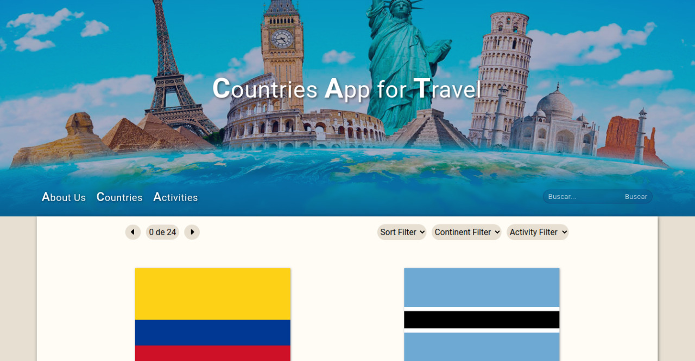
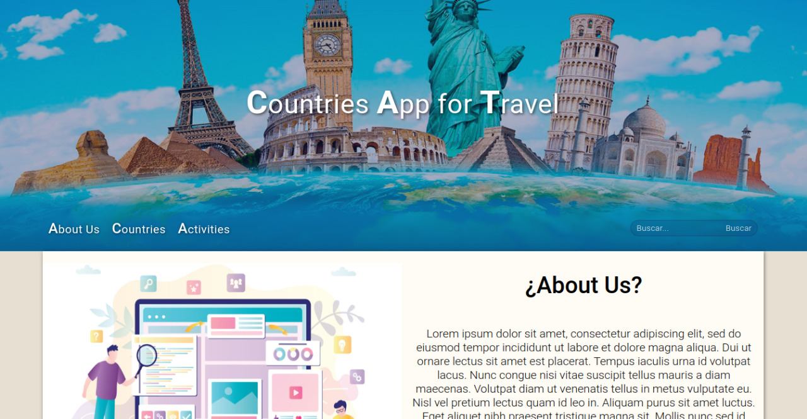
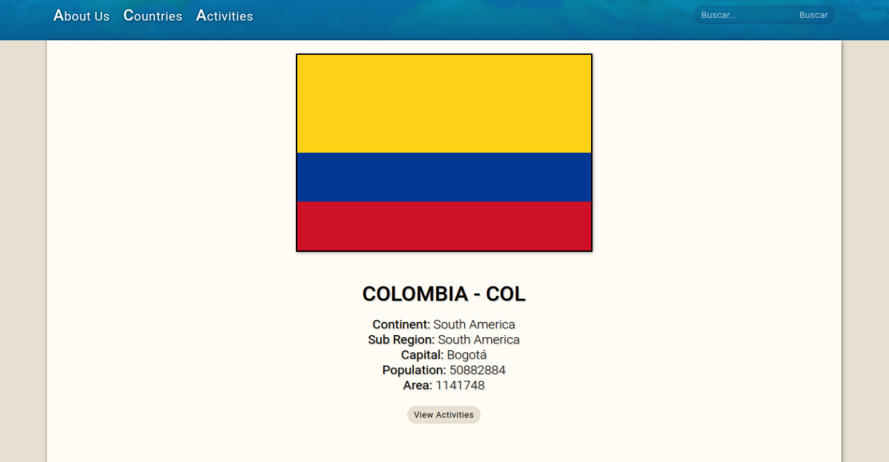
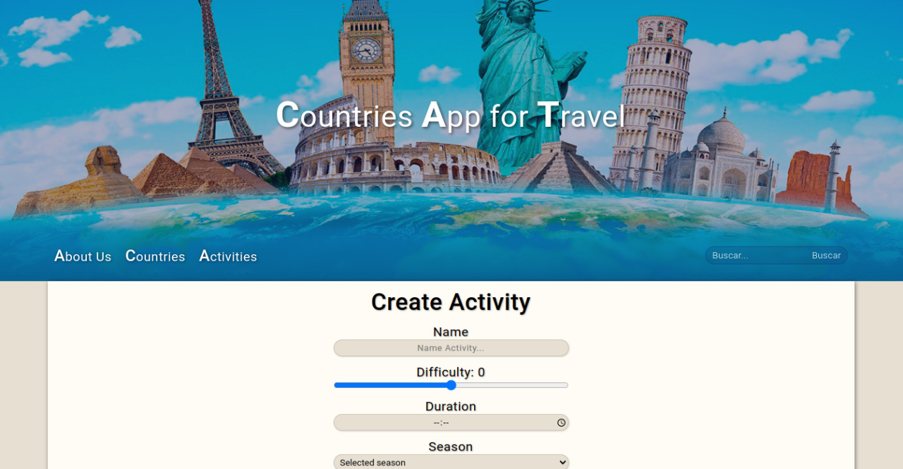

# Proyecto Individual - Countries API

## Objetivos del proyecto

- Construir una App utilizando React, Redux, Node y Sequelize.
- Afirmar y conectar los conceptos aprendidos en la carrera.
- Aprender y practicar el workflow de GIT

## Home

## About

## Detail

## Form
